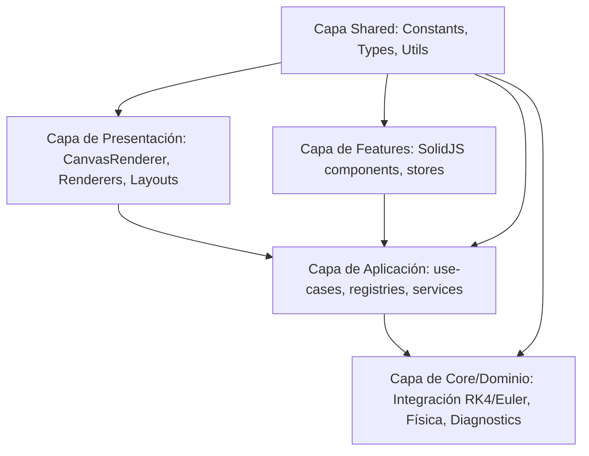

# OrbitalJS

## Miembros responsables del proyecto

- [Sabrina Ojeda](https://github.com/sabrinaAojeda)
- [Katherine Lopez](https://github.com/KathLoppz)
- [Luis Diaz](https://github.com/KathLoppz)
- [Joel Freire](#)
- [Sergio Arce](https://github.com/SergioMainJG)

## Descripción

Simulador de órbitas planetarias con datos reales de la NASA. Motor de integración numérica RK4 en TypeScript con SolidJS, visualización Canvas 2D y panel de energía con Chart.js.

### Propósito Pedagógico
OrbitalJS es una herramienta educativa e interactiva diseñada para la enseñanza y el aprendizaje de la mecánica celeste, la astrodinámica y los métodos de integración numérica. Su objetivo es permitir a los usuarios visualizar la dinámica orbital de sistemas planetarios complejos usando efemérides reales de la NASA JPL, estudiar la deriva numérica (acumulación de error de redondeo/truncamiento) y verificar de forma interactiva la conservación de la energía mecánica en el espacio.

## Requisitos previos

| Herramienta | Versión mínima | Para qué                            |
| :---------- | :------------- | :---------------------------------- |
| **Bun**     | 1.2.0+         | Runtime, package manager y bundler  |
| **Node.js** | 20.0.0+        | Fallback si Bun falla en algún paso |
| **Git**     | 2.40.0+        | Control de versiones                |

> **Nota:** Este proyecto usa **Bun** como package manager principal. Si no lo tienes, instálalo desde [bun.sh](https://bun.sh)

## Inicio rápido

```sh
git clone https://github.com/SergioMainJG/OrbitalJS.git
cd OrbitalJS
bun install
bun run dev       # http://localhost:3000
```

> **Nota**: No olviden copiar el `.env.template` a `.env`

### Obtención de Datos Reales (NASA Horizons)
El proyecto incluye un script de integración con el servicio API JPL Horizons de la NASA. Para actualizar las posiciones planetarias efemérides (NAIF IDs) locales:
```sh
bun run fetch:planets
```
Este comando consulta secuencialmente el servicio de la NASA, parsea las coordenadas tridimensionales en vectores cartesianos J2000 y actualiza el archivo de fallback local.

## Scripts disponibles

| Comando                 | Acción                                              |
| :---------------------- | :-------------------------------------------------- |
| `bun run dev`           | Servidor de desarrollo con HMR                      |
| `bun run build`         | Build de producción en `/dist`                      |
| `bun run serve`         | Preview del build de producción                     |
| `bun run test`          | Tests en modo watch                                 |
| `bun run test:ci`       | Tests una sola vez (para CI)                        |
| `bun run test:coverage` | Tests con reporte de cobertura                      |
| `bun run type:check`    | Verifica tipos TypeScript sin compilar              |
| `bun run lint`          | Lint del código fuente                              |
| `bun run lint:fix`      | Lint con auto-corrección                            |
| `bun run fmt`           | Formatea todo el código                             |
| `bun run fmt:check`     | Verifica formato sin modificar                      |
| `bun run check`         | Lint + formato + tipos + tests (lo que corre el CI) |

> **Antes de un PR**, corre `bun run check` localmente. Si pasa, el CI pasará.

## Estructura del proyecto

El proyecto ha sido refactorizado siguiendo una arquitectura limpia y modular dividida en capas desacopladas, lo que facilita la escalabilidad y las pruebas del simulador:

```sh
.
├── .github/
│   └── workflows/
│       └── ci.yml              # Pipeline: lint -> fmt -> tipos -> tests -> build
├── public/
│   └── data/
│       └── planets.json        # Datos orbitales reales pre-generados
├── src/
│   ├── core/                   # Capa de Dominio pura (física y lógica matemática sin frameworks)
│   │   ├── contracts/          # Contratos e interfaces base (Renderer, Scene, Scenario)
│   │   ├── diagnostics/        # Monitores de error y deriva de energía (orbitalError, energyDrift)
│   │   ├── engines/            # Motores puros de animación, comparación y paso de física
│   │   ├── physics/            # Integradores numéricos (RK4, Euler) y fórmulas de energía
│   │   └── validators/         # Validación física de órbitas cerradas
│   ├── application/            # Casos de uso de negocio y orquestación
│   │   ├── catalogs/           # Catálogos de escenarios celestes
│   │   ├── registries/         # Registros para inyección de dependencias (rendererRegistry)
│   │   ├── services/           # Servicios externos (JPL Horizons service facade)
│   │   └── use-cases/          # Casos de uso puros (loadScenario, compareIntegrators)
│   ├── features/               # Características funcionales empaquetadas (SolidJS logic + component UI)
│   │   ├── comparison/         # Módulo de comparación e interacción Euler vs RK4
│   │   ├── simulation/         # Controles de simulación, stores de estado reactivo y overlays
│   │   └── theory/             # Panel teórico "Cómo funciona"
│   ├── presentation/           # Capa de presentación visual e interfaces de usuario
│   │   ├── layouts/            # Estructuras de rejilla base y paneles del dashboard
│   │   ├── renderers/          # Dibujado 2D en Canvas (CanvasRenderer, Camera, DrawBodies, Launcher)
│   │   └── shared-components/  # Componentes transversales (legend-panel, tooltip, simulation-log)
│   ├── shared/                 # Recursos y utilidades compartidas y transversales
│   │   ├── constants/          # Constantes físicas y configuraciones globales de estilo
│   │   ├── types/              # Definición de tipos TypeScript compartidos
│   │   └── utils/              # Clases utilitarias (JPL fetcher/parser)
│   ├── index.css               # Estilos globales y Tailwind CSS v4
│   └── index.tsx               # Punto de entrada de la aplicación
├── tsconfig.json
└── vite.config.ts
```

### Cambios Arquitectónicos (Clean Architecture)

El simulador se ha estructurado bajo los principios de **Arquitectura Limpia (Clean Architecture)** con el fin de independizar la lógica física y matemática de la interfaz gráfica y de cualquier framework reactivo. Esto garantiza la testabilidad y la mantenibilidad a largo plazo mediante las siguientes capas desacopladas:



El flujo de control va desde la capa exterior de presentación/features hacia la capa de aplicación y, finalmente, hacia la capa central de dominio/core. A continuación se detallan las capas:

1. **Capa de Dominio / Core (`src/core/`)**:
   * **Física y Lógica Matemática Pura**: Contiene las ecuaciones de movimiento e integradores numéricos (como Runge-Kutta de 4.º orden y Euler en `core/physics/`), cálculo de diagnósticos orbitales (como deriva de energía mecánica y momento angular en `core/diagnostics/`) y validación física de órbitas cerradas en `core/validators/`.
   * **Independencia del Framework**: Esta capa es 100% JS/TS puro. No tiene noción alguna de SolidJS, señales, estados reactivos ni elementos del DOM. Permite ejecutar simulaciones y test unitarios de forma rápida y aislada.
   * **Contratos y Abstracciones (`core/contracts/`)**: Define interfaces estrictas como `Renderer`, `Scene` y `Scenario`. Cualquier motor de renderizado o escena celeste debe cumplir estos contratos.

2. **Capa de Aplicación (`src/application/`)**:
   * **Casos de Uso (`application/use-cases/`)**: Orquestan el flujo de datos e interacciones del negocio (por ejemplo, cargar un escenario planetario (`loadScenario`) o comparar la estabilidad de los integradores (`compareIntegrators`)).
   * **Registros e Inyección de Dependencias (`application/registries/`)**: Se utiliza el patrón Registry (ej. `rendererRegistry`) para registrar implementaciones concretas de contratos sin acoplar directamente el core con la presentación.
   * **Servicios de Fachada (`application/services/`)**: Definen la comunicación con fuentes externas, como la obtención de efemérides de la NASA (JPL Horizons).

3. **Capa de Características / Features (`src/features/`)**:
   * **Módulos Funcionales Autocontenidos**: Agrupa la interfaz de usuario en SolidJS con sus respectivos stores de estado reactivo locales (ej. `simulation-store.ts`, `comparison-store.ts`).
   * **Flujo Unidireccional de Dependencias**: Los componentes y stores consumen los casos de uso expuestos por la capa de aplicación, evitando mutaciones directas y acoplamientos innecesarios.

4. **Capa de Presentación (`src/presentation/`)**:
   * **Motores de Renderizado (`presentation/renderers/`)**: Implementaciones visuales concretas. `CanvasRenderer` dibuja en un elemento Canvas 2D utilizando el sistema de proyección de cámara (`camera.ts`), dibujado de cuerpos (`draw-bodies.ts`) e interfaces de lanzamiento de naves (`spaceship-launcher.ts`). Cumplen estrictamente con el contrato `Renderer`, permitiendo en el futuro una migración a 3D (WebGL o Three.js) sin alterar la lógica de negocio ni el core del simulador.
   * **Estructura y Componentes Compartidos**: Contiene los layouts responsivos del panel de control (`layouts/`) y los elementos reutilizables de UI (`shared-components/` como el registro de simulación `simulation-log`).

5. **Capa Compartida / Shared (`src/shared/`)**:
   * Alberga recursos transversales sin lógica de negocio, tales como constantes físicas y cosmológicas reales (ej. constante de gravitación universal escalada, límites de paso temporal $dt$, colores del simulador en `shared/constants/`), tipos comunes en TypeScript (`shared/types/`) y funciones auxiliares útiles (`shared/utils/`).

---

## Convenciones de Código y del Equipo

### Convenciones en el Código

Para mantener una base de código coherente, legible y libre de errores comunes, todo el equipo debe seguir rigurosamente las siguientes convenciones:

#### 1. Nomenclatura de Archivos (Kebab-Case)
* Todos los archivos y directorios del proyecto deben usar únicamente letras minúsculas y guiones como separadores (`kebab-case`). Esto aplica sin excepción a:
  * Componentes SolidJS (ej. `simulation-log.tsx`).
  * Archivos de estado/stores (ej. `simulation-store.ts`).
  * Utilidades, configuraciones y tests (ej. `constants.config.ts`, `scale.test.ts`).

#### 2. Tipado Estricto de TypeScript
* **Prohibición de `any`**: Está prohibido declarar variables o firmas de función utilizando el tipo `any`. Si el tipo es verdaderamente desconocido, debe usarse `unknown` junto con type guards o estrechamiento de tipos (*type narrowing*).
* **Importaciones de Tipos**: Las importaciones que solo involucren tipos TypeScript deben realizarse de forma explícita utilizando el modificador `import type` (ej. `import type { AstronomicalBody } from '@/shared/types'`).
* **Directivas de Compilación**: Se debe evitar el uso de `@ts-ignore`. En su lugar, se usará exclusivamente `@ts-expect-error` para indicar al compilador que se espera un error de tipos controlado, describiendo siempre el motivo del error inmediatamente al lado de la directiva.

#### 3. Prohibición de Guiones Bajos Iniciales o Finales
* Para garantizar la conformidad con las reglas de estilo globales de linters y formateadores, no se permite el uso de variables con guiones bajos iniciales o finales (dangling underscores) como `__launcher` o `_private`. Todas las variables internas o privadas en clases y módulos deben emplear un estilo claro en `camelCase` (ej. `launcherInstance`, `privateMethod`).

#### 4. Consumo Secuencial y Control de Tasa (Rate Limiting) en APIs
* Al consumir la API JPL Horizons de la NASA, las llamadas HTTP deben ejecutarse **estrictamente de forma secuencial** en un bucle (`for ... of`) empleando retardos artificiales explícitos (`await setTimeout`).
* Queda terminantemente prohibido el uso de `Promise.all` o llamadas en paralelo en este servicio para evitar la saturación de peticiones y subsecuentes bloqueos de dirección IP (baneos). Se debe añadir la regla `eslint-disable-next-line no-await-in-loop` únicamente sobre este flujo controlado.

#### 5. Política de Comentarios Limpios
* **Eliminación de Comentarios Redundantes**: Se deben remover todos los comentarios inline que expliquen el flujo de control obvio, anotaciones temporales de bugs ya resueltos o separadores estructurales de código.
* **Comentarios Permitidos**:
  * **Documentación TSDoc/JSDoc**: Obligatoria en clases, interfaces y funciones públicas para detallar su propósito, parámetros y tipos de retorno.
  * **Constantes Cosmólogicas/Físicas**: Todo valor numérico fijo o constante de configuración de física (como la masa de la nave, gravedad escalada, límites de paso de tiempo) debe ir acompañado de un comentario descriptivo y riguroso que justifique su valor y necesidad física.

#### 6. Convenciones de Diseño y Layout Responsivo
* El dashboard debe ser completamente responsive y adaptarse dinámicamente a todo tipo de pantallas mediante clases de utilidad de **Tailwind CSS** y componentes de **DaisyUI**:
  * **Diseño Desktop ($\ge 1024$px)**: Se organiza en una estructura de 3 columnas fijas (panel de control a la izquierda, canvas en el centro, y panel de gráficos e histórico a la derecha).
  * **Diseño Mobile/Tablet ($< 1024$px)**: Cambia automáticamente a una disposición de una sola columna vertical apilada.
  * **Control de Scroll**: En resoluciones de escritorio, el scroll de la página completa está deshabilitado (`overflow: hidden`). Al cruzar el umbral responsivo de $1024$px, el layout de la app debe permitir el scroll vertical de la ventana raíz (`overflow-y: auto`), manteniendo los componentes internos (como el gráfico de energía o el log de simulación) adaptables en altura, con áreas internas de scroll específicas para que nunca colapsen o trunquen información.

### Commits

Seguimos [Conventional Commits](https://www.conventionalcommits.org/):

```
feat: agregar integrador Verlet como alternativa a RK4
fix: corregir cálculo de energía potencial cuando r → 0
docs: actualizar README con nuevas instrucciones de setup
refactor: extraer camera transform a su propio módulo
test: agregar tests para el integrador RK4
```

### Flujo de trabajo

1. Crear rama desde `develop`con un significativo de los titulos descritos en los issues. Ejemplo: `fetching-parsing-jpl-horizons`: `git checkout -b`
2. Desarrollo + commits frecuentes
3. `bun run check` antes de push
4. PR hacia `develop` (no directo a `main`)
5. Al menos 1 revisión antes de mergear (Poner a quien desea que se revise la PR)

## Dependencias principales

| Paquete                                | Versión | Para qué                                    |
| :------------------------------------- | :------ | :------------------------------------------ |
| [solid-js](https://www.solidjs.com)    | ^1.9    | Framework UI reactivo (>>>react)            |
| [chart.js](https://www.chartjs.org)    | ^4.5    | Gráficas de energía en tiempo real          |
| [tailwindcss](https://tailwindcss.com) | ^4.2    | Estilos (CSS-first, sin tailwind.config.js) |
| [daisyui](https://daisyui.com)         | ^5.5    | Componentes UI sobre Tailwind               |

> **Tailwind v4**: No existe `tailwind.config.js`. La configuración es CSS-first: temas y plugins se definen en `index.css` o en `vite.config.ts`. DaisyUI v5 usa el mismo sistema.

## Extensiones de VS Code

Instala las extensiones listadas en `.vscode/extensions.json`. VS Code las sugerirá automáticamente al abrir el proyecto.

### Obligatorias

| Extensión                          | Para qué                                       |
| :--------------------------------- | :--------------------------------------------- |
| `solidjs-community.solid-snippets` | Snippets de SolidJS, autocompletado de signals |
| `bradlc.vscode-tailwindcss`        | Autocompletado de clases Tailwind v4           |
| `oxc.oxc-vscode`                   | Errores de oxlint inline en el editor          |
| `esbenp.prettier-vscode`           | Formateo al guardar                            |
| `vitest.explorer`                  | Correr tests desde el editor                   |

### Recomendadas

| Extensión                            | Para qué                                           |
| :----------------------------------- | :------------------------------------------------- |
| `pmneo.tsimporter`                   | Auto-imports de tipos y funciones                  |
| `usernamehw.errorlens`               | Errores TS inline, sin abrir el panel de problemas |
| `christian-kohler.path-intellisense` | Autocompletado en imports                          |

## Fallback a npm

```sh
npm install
npm run dev
```

> El campo `packageManager` en `package.json` está fijado a `bun@1.3.13`. Con npm, ignora ese campo.

## Aclaración sobre posible error en `vite.config.ts`

Se está usando [rolldown](https://rolldown.rs) en vez de [rollup](https://rollupjs.org) a través de `rolldown-vite`. Este es el nuevo motor de empaquetado ultra rápido escrito en Rust que Vite adoptará en el futuro. Puede generar algunas advertencias o pequeñas diferencias en los tipos de `rollupOptions` (como `advancedChunks`), pero acelera significativamente el tiempo de compilación.

## Testing

Se va a crear una rama de testing. Se van a subir los archivos de testing, en los cuales ustedes tienen toda la libertad de modificar, cambiar nombre, etc. Aunque se espera que cumplan con las reglas estableciddas con las nomenclaturas, etc. El testing tiene proposito de disminuir errores en los merge y en tiempo de producción.
Yo, **Sergio Arce**, soy quien va a escribir el testing. Si no saben como usar `vitest` o realizar testing, no tengan duda en pasar la issue conmigo, o bien, usar alguna IA **(solamente asegurense de usar todo el issue completo como referencia)** para modificar el test.
Cada que hacen un commit, se ejecuta un commit de testing automatico, tanto en local como en github (el wf que implementé).

Voy a implementar el testing correspondiente a cada issue de cada sprint, y reitero, reimplementen si así lo consideran necesarios

## Fundamentos Matemáticos y Físicos

El simulador implementa dos métodos de integración numérica y herramientas para medir la deriva de energía. A continuación se resumen sus bases matemáticas:

### 1. Integración Numérica Runge-Kutta de 4.º Orden (RK4)
Para resolver las ecuaciones diferenciales del movimiento $\ddot{\mathbf{r}} = \mathbf{a}(\mathbf{r})$, el método RK4 calcula cuatro aproximaciones de la derivada dentro de cada paso temporal $dt$:

1. **Evaluación al inicio del intervalo ($k_1$):**
   $$k_{1,v} = \mathbf{a}(\mathbf{r}_n) \cdot dt$$
   $$k_{1,r} = \mathbf{v}_n \cdot dt$$

2. **Evaluación en la mitad del intervalo usando $k_1$ ($k_2$):**
   $$k_{2,v} = \mathbf{a}(\mathbf{r}_n + \frac{1}{2}k_{1,r}) \cdot dt$$
   $$k_{2,r} = (\mathbf{v}_n + \frac{1}{2}k_{1,v}) \cdot dt$$

3. **Evaluación en la mitad del intervalo usando $k_2$ ($k_3$):**
   $$k_{3,v} = \mathbf{a}(\mathbf{r}_n + \frac{1}{2}k_{2,r}) \cdot dt$$
   $$k_{3,r} = (\mathbf{v}_n + \frac{1}{2}k_{2,v}) \cdot dt$$

4. **Evaluación al final del intervalo usando $k_3$ ($k_4$):**
   $$k_{4,v} = \mathbf{a}(\mathbf{r}_n + k_{3,r}) \cdot dt$$
   $$k_{4,r} = (\mathbf{v}_n + k_{3,v}) \cdot dt$$

**Actualización final:**
$$\mathbf{r}_{n+1} = \mathbf{r}_n + \frac{1}{6}(k_{1,r} + 2k_{2,r} + 2k_{3,r} + k_{4,r})$$
$$\mathbf{v}_{n+1} = \mathbf{v}_n + \frac{1}{6}(k_{1,v} + 2k_{2,v} + 2k_{3,v} + k_{4,v})$$

### 2. Conservación de la Energía Mecánica
En un sistema gravitatorio aislado, la energía mecánica total $E_{\text{total}} = E_{\text{cinética}} + E_{\text{potencial}}$ debe permanecer constante.
* **Energía Cinética ($T$):**
  $$T = \sum_{i} \frac{1}{2} m_i \|\mathbf{v}_i\|^2$$
* **Energía Potencial Gravitatoria ($U$):**
  $$U = -\sum_{i} \sum_{j < i} \frac{G m_i m_j}{\|\mathbf{r}_i - \mathbf{r}_j\|}$$

La **deriva de energía (Drift)** mide el error acumulado relativo de la energía total del sistema respecto al instante inicial $t=0$:
$$\text{Drift (\%)} = \frac{|E_{\text{total}}(t) - E_{\text{total}}(0)|}{|E_{\text{total}}(0)|} \times 100$$

Un valor superior al $1\%$ indica que el integrador está perdiendo precisión física debido a un paso temporal ($dt$) demasiado grande para la velocidad y proximidad de los cuerpos celestes (por ejemplo, cerca del periápside).

## Production URL

> ### See the production in [orbitaljs](https://orbitaljs.sergioar.dev)
